### Tasks inspired by the world

#### coloured trees in autumn
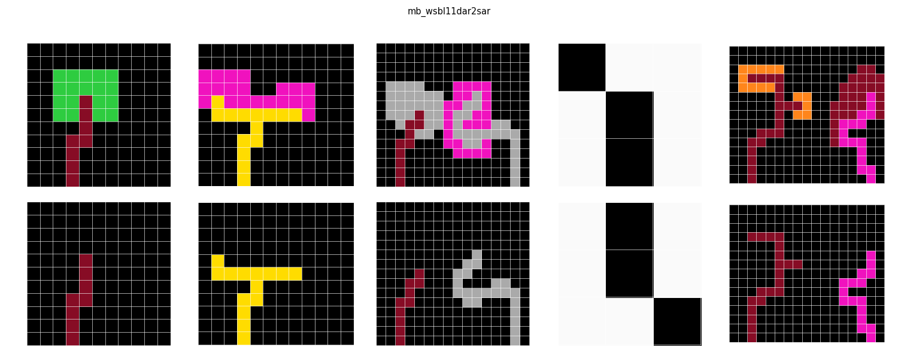
#### shortest path
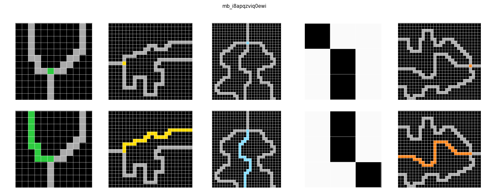
#### flowers
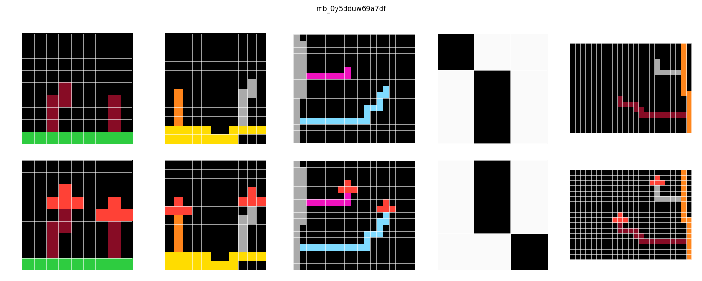
#### water falling
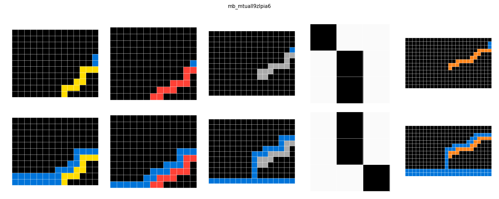
#### wagon along a rail
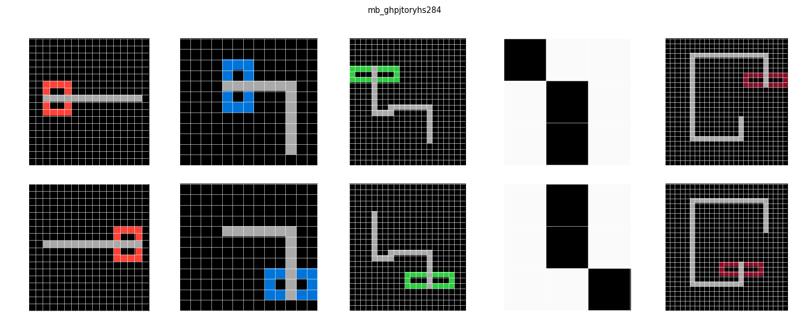
#### airplane landing with obsacles
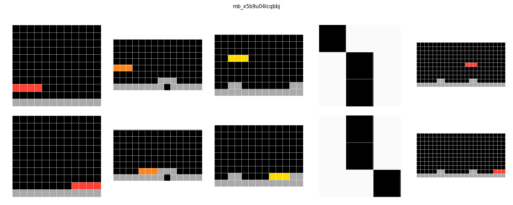
#### light refraction
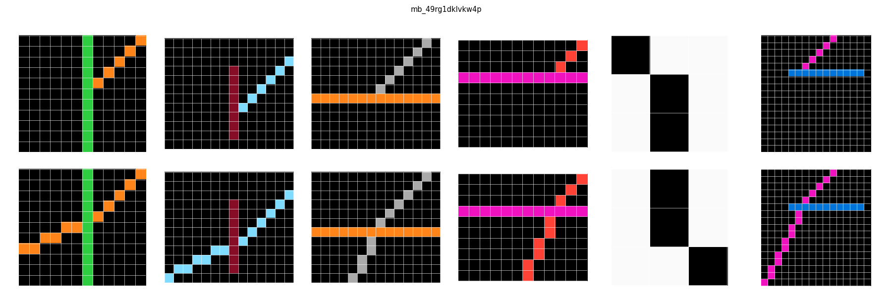
#### object falling along an inclinded plane
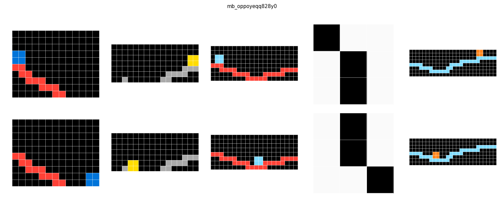

#### antenna emitting spherical waves
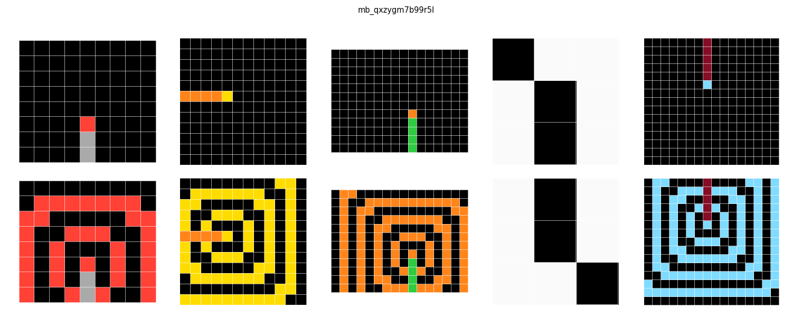

#### double wave refraction
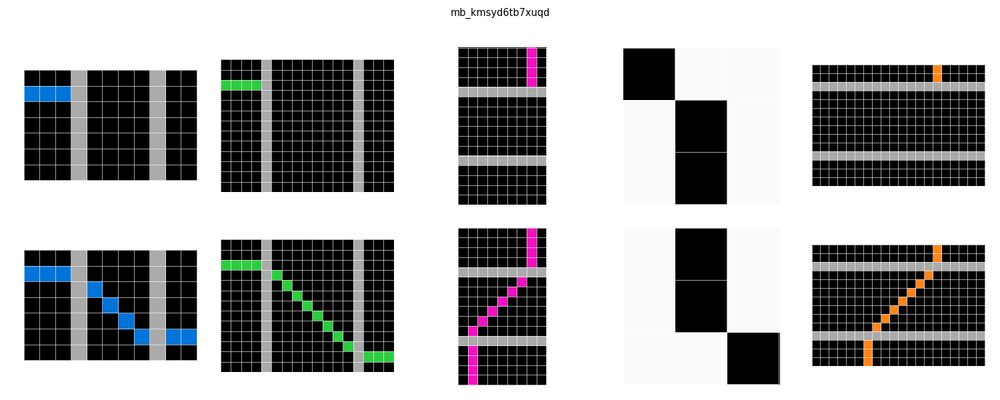

#### wave diffraction
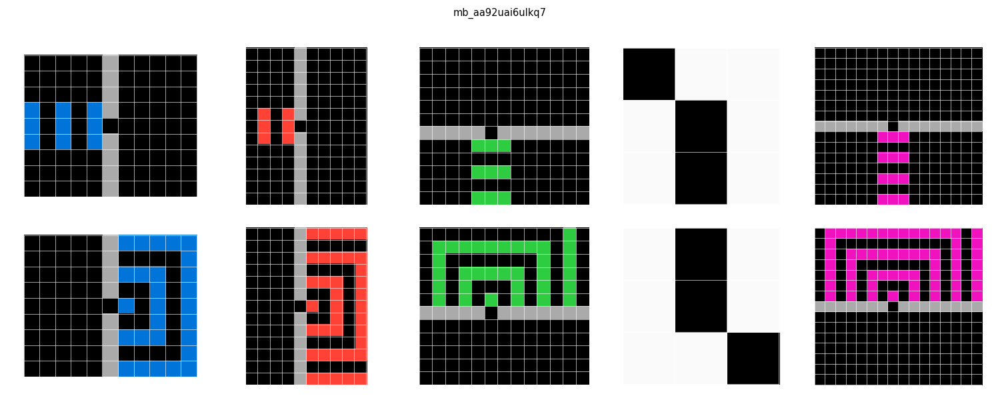

#### Stalactite formation
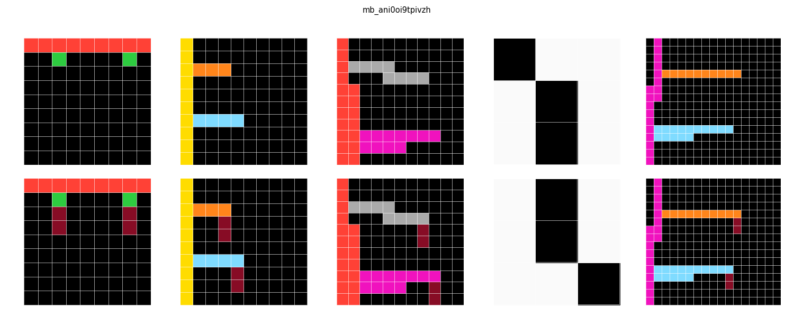

#### gravity on a joint
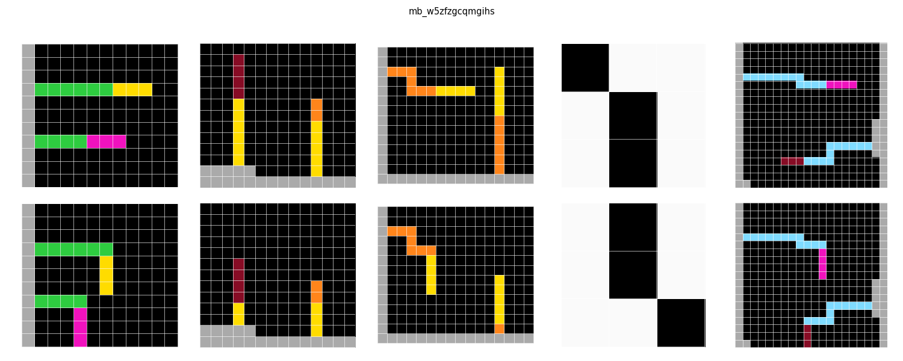

#### pruning dead branch
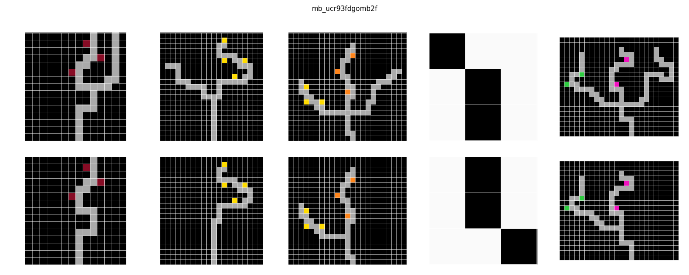

#### magnets with magnetic field
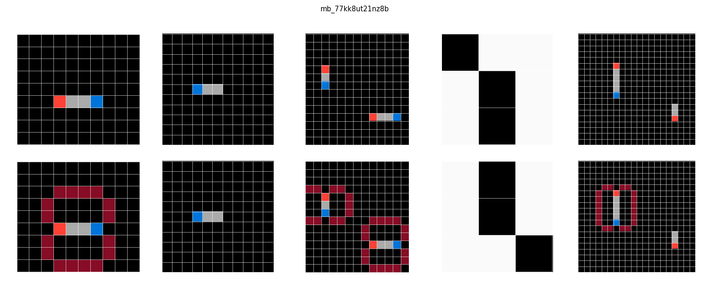